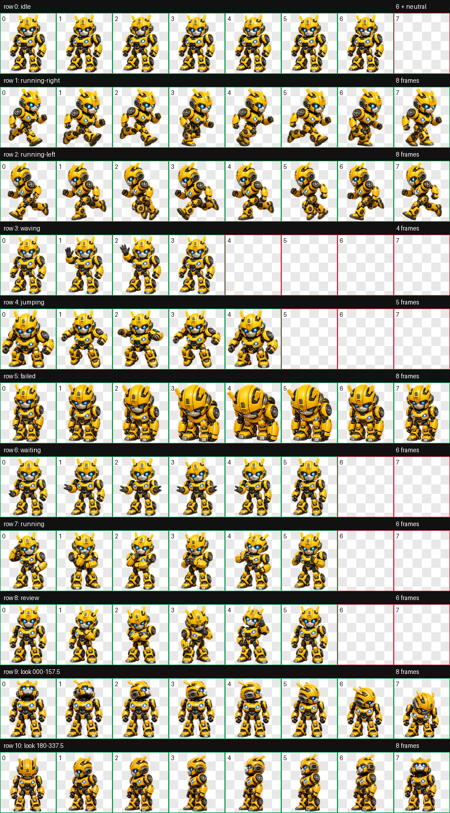

# Codex Bumblebee Pet / Codex 大黄蜂宠物

An unofficial, fan-made Bumblebee animated pet for the Codex desktop app.

这是一个供 Codex 桌面应用使用的非官方大黄蜂动画宠物。

**[View Bumblebee on PetDex / 在 PetDex 查看大黄蜂](https://petdex.dev/pets/bumblebee-2)**



## Features / 功能

- Codex pet sprite contract v2
- 8 columns × 11 rows, 192 × 208 pixels per cell
- 9 standard animation states
- 16 clockwise look directions
- Transparent WebP spritesheet

## Install / 安装

macOS or Linux:

```bash
git clone https://github.com/linabellbiu/codex-bumblebee-pet.git
cd codex-bumblebee-pet
./install.sh
```

Restart Codex after installation, then select “大黄蜂” from the pets menu.

安装后重新启动 Codex，然后在宠物菜单中选择“大黄蜂”。

Manual installation:

```bash
mkdir -p ~/.codex/pets/bumblebee
cp pet/bumblebee/pet.json ~/.codex/pets/bumblebee/
cp pet/bumblebee/spritesheet.webp ~/.codex/pets/bumblebee/
```

## Files

```text
pet/bumblebee/pet.json
pet/bumblebee/spritesheet.webp
preview/contact-sheet.png
install.sh
NOTICE.md
```

## Uninstall / 卸载

```bash
rm -rf ~/.codex/pets/bumblebee
```

## Legal notice

This is an unofficial fan project and is not affiliated with, endorsed by, or sponsored by Hasbro, Paramount, OpenAI, or their affiliates. Transformers and Bumblebee are associated with their respective rights holders. See [NOTICE.md](NOTICE.md).

Because this repository depicts a third-party character, no open-source or Creative Commons license is offered for the character artwork. You are responsible for determining whether your use is permitted in your jurisdiction.
